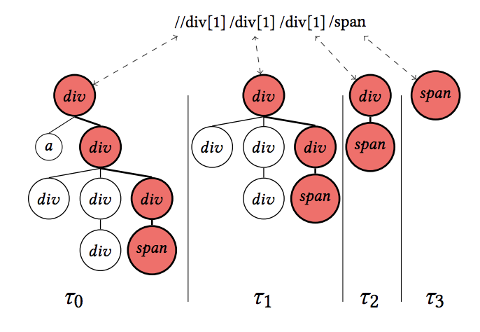

# XTreePath: A generalization of XPath to handle real world structural variation

Code for the paper:

XTreePath: A generalization of XPath to handle real world structural variation. Joseph Paul Cohen, Wei Ding, Abraham Bagherjeiran. [https://arxiv.org/abs/1505.01303](https://arxiv.org/abs/1505.01303)

The data used in the paper is here: [https://academictorrents.com/details/411576c7e80787e4b40452360f5f24acba9b5159](https://academictorrents.com/details/411576c7e80787e4b40452360f5f24acba9b5159)

